# WorkFox

> Workflow + AI Agent 桌面应用，基于 Electron + Vue 3 构建，提供可视化工作流编排与 AI Agent 驱动的自动化能力。

## 项目愿景

WorkFox 是一款桌面端工作流自动化工具，核心定位：

- **可视化工作流编辑器**：基于 Vue Flow 的拖拽式 DAG 编辑器，支持多种节点类型（流程控制、AI 执行、浏览器交互、展示等），含复合节点（loop 等）和嵌入式子工作流
- **AI Agent 集成**：通过 Claude Agent SDK（@anthropic-ai/claude-agent-sdk）在主进程和 backend 中运行 AI Agent，支持流式输出、工具调用、thinking blocks、MCP Server 工具桥接
- **插件系统**：支持 `server` / `client` / Web CDN manifest 三类插件扩展，可注册自定义工作流节点、工具和视图；client 插件可通过 WS 通道注册到 backend
- **多标签页**：多工作流并行编辑，每个标签页独立维护工作流状态和 Chat 会话
- **Web 模式**：支持脱离 Electron 在纯浏览器中运行，通过 WebSocket 连接 backend 服务

## 架构总览

采用 Electron 标准三层架构（Main / Preload / Renderer）+ 独立 Backend 进程：

```
Renderer (Vue 3 + Vite)
  |-- src/                      渲染进程（前端）
  |   |-- views/                页面级组件（Home / Editor / Gallery）
  |   |-- components/           业务组件（chat / workflow / settings / gallery / command-palette / ui）
  |   |-- stores/               Pinia 状态管理（chat / workflow / ai-provider / tab / plugin / ...）
  |   |-- lib/                  核心逻辑库
  |   |   |-- agent/            Agent 流式通信、工具发现、工作流工具定义
  |   |   |-- workflow/         工作流引擎（拓扑排序、节点分发、变量解析、执行引擎）
  |   |   |-- backend-api/      Backend WS 通道客户端适配层
  |   |   |-- ws-bridge.ts      WebSocket 连接管理、请求/响应/事件分发
  |   |-- composables/          Vue composables（工作流画布、剪贴板、快捷键等）
  |   |-- router/               Vue Router（hash 模式）
  |   |-- types/                TypeScript 类型定义
  |   |-- styles/               Tailwind CSS 全局样式（含 light/dark 主题变量）
  |   |-- web/                  Web 模式入口与 BrowserAPIAdapter
  |
Preload
  |-- preload/index.ts          contextBridge API 定义（IPC 通道映射）
  |
Main (Electron)
  |-- electron/
      |-- main.ts               应用入口，创建窗口、注册 IPC handlers、启动 backend 子进程
      |-- ipc/                  IPC handlers（chat / workflow / plugin / shortcut / tabs / agent-settings / backend / fs）
      |-- services/             核心业务服务
          |-- claude-agent-runtime.ts   Claude Agent SDK 运行时（流式桥接、工具适配）
          |-- backend-process.ts        Backend 子进程生命周期管理
          |-- workflow-store.ts         工作流持久化（每工作流独立 JSON 文件）
          |-- plugin-manager.ts         Electron 本地 client 插件生命周期管理（扫描/加载/启用/禁用）
          |-- plugin-runtime-host.ts    Electron client 插件运行时宿主
          |-- plugin-catalog.ts         Electron 本地插件目录扫描与元数据
          |-- store.ts                  electron-store 全局配置（AI providers / shortcuts / tabs）
          |-- chat-history-store.ts     Chat 历史（IndexedDB 跨进程代理或文件存储）
          |-- workflow-node-registry.ts 工作流节点注册表（内置 + 插件）
          |-- builtin-nodes.ts          内置节点定义（start/end/run_code/toast/switch/loop/sub_workflow）
          |-- ...
  |
Backend (Node.js 子进程)
  |-- backend/
      |-- main.ts               backend 入口，启动 HTTP + WS 服务
      |-- app/                  config / logger / server factory
      |-- ws/                   channel router / connection manager / handlers
      |-- workflow/             execution-manager / interaction-manager
      |-- storage/              workflow / version / execution-log / operation-history / ai-provider / chat-history / settings
      |-- plugins/              plugin-registry / builtin-fs-api / builtin-fetch-api
      |-- chat/                 chat-runtime / chat-tool-adapter / chat-workflow-tool-executor / client-node-cache
  |
Shared
  |-- shared/                  前后端共享协议、执行事件、插件入口与能力定义
      |-- channel-contracts.ts  BackendChannel 类型安全契约（请求/响应类型映射）
      |-- channel-metadata.ts   通道元数据（超时/优先级/幂等性）
      |-- execution-events.ts   工作流执行事件协议
      |-- ws-protocol.ts        WS 消息协议（request/response/event/interaction）
      |-- workflow-types.ts     工作流核心类型定义（含复合节点/嵌入式工作流）
      |-- workflow-composite.ts 复合节点查询工具（loop 节点树遍历/scope/过滤）
      |-- embedded-workflow.ts  嵌入式子工作流创建与规范化
      |-- shortcut-types.ts     快捷键类型定义
      |-- workflow-local-bridge.ts  主进程桥接节点定义（delay）
      |-- plugin-types.ts       插件类型定义
      |-- plugin-entry.ts       插件入口文件解析
      |-- plugin-capability-loader.ts 插件能力加载（workflow/tools/api 模块）
      |-- errors.ts             后端错误码与错误构造器
```

## 模块结构图

```mermaid
graph TD
    ROOT["WorkFox (根)"] --> RENDERER["src/ -- 渲染进程"]
    ROOT --> PRELOAD["preload/ -- 桥接层"]
    ROOT --> MAIN["electron/ -- 主进程"]
    ROOT --> BACKEND["backend/ -- Backend 服务"]
    ROOT --> SHARED["shared/ -- 共享协议"]
    ROOT --> RESOURCES["resources/ -- 内置插件"]

    RENDERER --> VIEWS["views/ -- 页面"]
    RENDERER --> COMPONENTS["components/"]
    RENDERER --> STORES["stores/"]
    RENDERER --> LIB["lib/"]
    RENDERER --> WEB["web/ -- Web 模式"]
    RENDERER --> TYPES_SRC["types/"]

    COMPONENTS --> CHAT_CMP["chat/"]
    COMPONENTS --> WF_CMP["workflow/"]
    COMPONENTS --> SETTINGS_CMP["settings/"]
    COMPONENTS --> GALLERY_CMP["gallery/"]
    COMPONENTS --> CMD_CMP["command-palette/"]
    COMPONENTS --> UI_CMP["ui/ -- 基础组件库"]

    LIB --> AGENT_LIB["agent/"]
    LIB --> WF_LIB["workflow/"]
    LIB --> BACKEND_API["backend-api/"]

    WF_LIB --> WF_ENGINE["engine.ts"]
    WF_LIB --> WF_REGISTRY["nodeRegistry.ts"]
    WF_LIB --> WF_NODES["nodes/"]

    MAIN --> MAIN_ENTRY["main.ts"]
    MAIN --> IPC["ipc/"]
    MAIN --> SERVICES["services/"]

    SERVICES --> CLAUDE_RT["claude-agent-runtime.ts"]
    SERVICES --> BACKEND_PROC["backend-process.ts"]
    SERVICES --> WF_STORE["workflow-store.ts"]
    SERVICES --> PLUGIN_MGR["plugin-manager.ts"]
    SERVICES --> STORE_GLOBAL["store.ts"]

    BACKEND --> BACKEND_MAIN["main.ts"]
    BACKEND --> BACKEND_APP["app/"]
    BACKEND --> BACKEND_WS["ws/"]
    BACKEND --> BACKEND_WF["workflow/"]
    BACKEND --> BACKEND_STORAGE["storage/"]
    BACKEND --> BACKEND_PLUGINS["plugins/"]
    BACKEND --> BACKEND_CHAT["chat/"]

    BACKEND_CHAT --> CHAT_RT["chat-runtime.ts"]
    BACKEND_CHAT --> CHAT_ADAPTER["chat-tool-adapter.ts"]
    BACKEND_CHAT --> CHAT_EXECUTOR["chat-workflow-tool-executor.ts"]
    BACKEND_CHAT --> CLIENT_CACHE["client-node-cache.ts"]

    SHARED --> SHARED_CONTRACTS["channel-contracts.ts"]
    SHARED --> SHARED_EVENTS["execution-events.ts"]
    SHARED --> SHARED_PROTOCOL["ws-protocol.ts"]
    SHARED --> SHARED_WF_TYPES["workflow-types.ts"]
    SHARED --> SHARED_COMPOSITE["workflow-composite.ts"]
    SHARED --> SHARED_EMBEDDED["embedded-workflow.ts"]
    SHARED --> SHARED_SHORTCUT["shortcut-types.ts"]

    RESOURCES --> PLUGINS_BUILTIN["plugins/"]

    click RENDERER "./src/CLAUDE.md" "查看 src 模块文档"
    click PRELOAD "./preload/CLAUDE.md" "查看 preload 模块文档"
    click MAIN "./electron/CLAUDE.md" "查看 electron 模块文档"
    click BACKEND "./backend/CLAUDE.md" "查看 backend 模块文档"
    click SHARED "./shared/CLAUDE.md" "查看 shared 模块文档"
    click RESOURCES "./resources/CLAUDE.md" "查看 resources 模块文档"
```



## 模块索引

| 模块路径 | 职责 | 语言 | 入口文件 |
|---|---|---|---|
| `src/` | 渲染进程（Vue 3 SPA），含 Web 模式 | TypeScript / Vue | `src/main.ts` / `src/web/web-entry.ts` |
| `src/lib/agent/` | AI Agent 流式通信、工具发现、工作流工具 | TypeScript | `agent.ts` |
| `src/lib/workflow/` | 工作流本地 fallback 执行引擎 | TypeScript | `engine.ts` |
| `src/lib/backend-api/` | Backend WS 通道客户端适配层 | TypeScript | `workflow-domain.ts` |
| `src/components/chat/` | Chat 对话面板组件集 | Vue / TS | - |
| `src/components/workflow/` | 工作流编辑器组件集（画布、节点、属性面板、嵌入式子工作流） | Vue / TS | - |
| `src/components/settings/` | 设置对话框组件 | Vue / TS | - |
| `src/stores/` | Pinia 状态管理 | TypeScript | - |
| `src/types/` | 全局类型定义 | TypeScript | `index.ts` |
| `src/web/` | Web 模式入口与 BrowserAPIAdapter | TypeScript | `web-entry.ts` |
| `preload/` | Electron Preload（contextBridge） | TypeScript | `index.ts` |
| `electron/` | Electron 主进程 | TypeScript | `main.ts` |
| `electron/ipc/` | IPC Handler 注册 | TypeScript | - |
| `electron/services/` | 主进程业务服务 | TypeScript | - |
| `backend/` | Node.js backend 服务（独立子进程） | TypeScript | `backend/main.ts` |
| `backend/workflow/` | 工作流执行管理器与交互管理器 | TypeScript | `execution-manager.ts` |
| `backend/storage/` | 后端数据持久化层 | TypeScript | - |
| `backend/plugins/` | 后端插件注册表 | TypeScript | `plugin-registry.ts` |
| `backend/chat/` | Chat 运行时、工具适配器、工作流工具执行器、客户端节点缓存 | TypeScript | `chat-runtime.ts` |
| `shared/` | 前后端共享协议、类型与工具（含复合节点/嵌入式工作流/快捷键） | TypeScript | `shared/index.ts` |
| `resources/plugins/` | 内置插件与商店元数据（含 Web client manifest 示例） | JavaScript / JSON | 各 `main.js` / `web-plugin.json` |

## 运行与开发

```bash
# 安装依赖（pnpm）
pnpm install

# 开发模式（electron-vite dev，含 HMR）
pnpm dev

# Web 模式开发（纯浏览器）
pnpm dev:web

# 构建产物
pnpm build

# 单独编译 backend
pnpm build:backend

# 打包安装程序（electron-builder）
pnpm pack
```

### 环境要求

- Node.js >= 18
- pnpm >= 10
- Electron 35.x（devDependency 自动安装）

### 构建工具链

- **electron-vite** 3.x：主进程 / 预加载 / 渲染进程三合一 Vite 构建
- **electron-builder** 26.x：多平台打包（macOS DMG, Windows NSIS）
- **Tailwind CSS** 4.x（通过 @tailwindcss/vite 插件集成）
- **TypeScript** 5.7.x

### 路径别名

- `@/*` -> `./src/*`（在 `tsconfig.web.json` 和 `electron.vite.config.ts` 中配置）
- `@shared/*` -> `./shared/*`（renderer / backend / node 共享协议）

### 双模式运行

WorkFox 支持两种运行模式：

1. **Electron 桌面模式**：`pnpm dev` -- 完整桌面应用，Electron 主进程通过 `backend-process.ts` fork 后端子进程
2. **Web 浏览器模式**：`pnpm dev:web` -- 纯浏览器 SPA，通过 `BrowserAPIAdapter` 将所有 `window.api` 调用桥接到 backend WS

## 插件系统状态

- 插件来源不是单一目录，而是三路聚合：
  - backend `plugin:list` -> `server` 插件
  - Electron `plugin:list-local` -> 本地 `client` 插件
  - Web `web-client-runtime` -> 已安装 CDN `client` 插件
- `server` 插件默认扫描：
  - `backend/data/plugins`
  - `resources/plugins`（兼容内置插件）
- Electron 本地插件默认扫描：
  - 开发态 `resources/plugins`
  - 打包后 `process.resourcesPath/plugins`
- Web 不扫描本地插件目录；Web client 插件只能通过 `manifestUrl` + CDN 方式安装
- 当前内置插件按运行时建议理解：
  - `workfox.window-manager` -> `client`（Electron only）
  - `workfox.file-system` -> `server`
  - `workfox.fetch` -> `server`
  - `workfox.jimeng` -> `server`
  - `workfox.fish-audio` -> `server`
  - `workfox.aliyun-ai` -> `server`
  - `workfox.openai` -> `server`
  - `workfox.epub-parser` -> `server`
- 工作流节点执行分流：
  - backend 可执行插件节点通过 backend `agent:execTool` / `pluginRegistry.executeWorkflowNode()`
  - 本地桥接节点（如 `delay`）通过 Electron `window.api.agent.execTool(...)`
- Client 插件可通过 `chat:register-client-nodes` / `chat:register-client-agent-tools` WS 通道注册节点定义和工具到 backend

## Backend Migration Status

- workflow CRUD、folder、version、execution log、operation history 已可通过 backend WS 通道工作
- workflow execution 已默认按 backend-first 设计组织，前端 store 通过 execution events 和 recovery 驱动执行态
- `agent_run`、`window-manager`、`delay` 这类本地能力通过 interaction bridge 回到 Electron 执行
- renderer 不再保留已迁移 domain 的旧 IPC / 本地执行 fallback；仅单节点调试和明确的桌面本地能力继续留在 Electron
- Web 模式下 chat 流式输出通过 backend `ChatRuntime` 直接驱动，无需 Electron 中转
- Chat 工具体系通过 `ChatToolAdapter` 桥接到 Claude Agent SDK MCP Server 模式
- `ChatWorkflowToolExecutor` 支持在 Chat 对话中直接操作工作流图结构（含复合节点和嵌入式子工作流）
- `ClientNodeCache` 管理来自客户端注册的插件节点和工具

### Feature Flag

- backend workflow/domain 已改为默认主路径，旧 `workfox.useWorkflowBackend` 开关已移除

### Verification Gate

迁移相关的最小回归命令：

```bash
pnpm exec tsc -p tsconfig.web.json --noEmit
pnpm build:backend
pnpm build
```

更细的验证说明见：

- `docs/superpowers/plans/2026-04-22-workfox-backend-migration-verification.md`

## 复合节点与嵌入式工作流

- **复合节点（Compound Node）**：通过 `CompoundNodeDefinition` 定义，创建时自动生成多个子节点和内部连线
  - 典型例子：`loop` 节点（生成 loop 根节点 + loop_body 子节点）
  - 子节点通过 `WorkflowNodeCompositeMeta`（rootId/parentId/role/generated/hidden/scopeBoundary）关联
  - 查询工具在 `shared/workflow-composite.ts`
- **嵌入式子工作流（Embedded Workflow）**：节点内部包含独立的 nodes + edges 子图
  - 存储在 `WorkflowNode.data.bodyWorkflow`（类型为 `EmbeddedWorkflow`）
  - 创建/规范化工具在 `shared/embedded-workflow.ts`
  - 渲染端通过 `EmbeddedWorkflowEditor` 组件（独立 VueFlow 实例）编辑
  - `LoopBodyContainer` 是 loop_body 节点的专用容器
- **执行端支持**：`ExecutionManager` 支持递归执行嵌入式子工作流；`ChatWorkflowToolExecutor` 支持通过 `embeddedInNodeId` 参数操作子工作流

## 测试策略

当前项目尚未包含自动化测试框架。建议未来引入：

- 单元测试：Vitest（与 Vite 生态一致）
- 组件测试：@vue/test-utils
- E2E 测试：Playwright（Electron 支持）

## 编码规范

- **语言**：TypeScript strict mode（所有 tsconfig 均启用 `strict: true`）
- **前端框架**：Vue 3 Composition API（`<script setup lang="ts">`）
- **状态管理**：Pinia（factory 模式创建 scope 化 store，如 `createChatStore(scope)`）
- **样式**：Tailwind CSS 4 + CSS 自定义属性主题系统（light/dark）
- **IPC 通信**：通过 `preload/index.ts` 的 `contextBridge.exposeInMainWorld('api', ...)` 统一暴露
- **WS 通信**：通过 `ws-bridge.ts` 的 `WSBridge` 类管理连接、请求/响应配对、事件订阅
- **数据持久化**：
  - 渲染进程：Dexie（IndexedDB）用于 Chat 会话/消息
  - 主进程：electron-store（JSON 文件）用于全局配置；独立 JSON 文件用于工作流
  - Backend：JSON 文件存储（通过 `BackendSettingsStore` 和各 domain store）
- **组件库**：shadcn-vue 风格的基础 UI 组件（`src/components/ui/`）

## AI 使用指引

### 核心数据流

1. 用户在 Chat 面板输入消息 -> `stores/chat.ts` -> `lib/agent/agent.ts`（构造请求）
2. 通过 `window.api.chat.completions()` 发送到 Electron 主进程 IPC（桌面模式）或 WS backend（Web 模式）
3. 主进程 `claude-agent-runtime.ts` / 后端 `chat-runtime.ts` 使用 Claude Agent SDK 创建流式会话
4. Backend 中 `ChatToolAdapter` 将工具桥接到 MCP Server（workflow / plugin / browser 三类）
5. `ChatWorkflowToolExecutor` 允许 AI 直接操作工作流图结构
6. 流式事件通过 IPC `chat:stream:*` 或 WS `chat:chunk/thinking/usage/done/error` 回传
7. 渲染进程 `lib/agent/stream.ts` 解析事件，更新 Pinia store，驱动 UI 更新

### 工作流执行

1. backend `execution-manager` 负责工作流执行、pause/resume/stop、execution recovery、execution log 持久化
2. 支持复合节点展开和嵌入式子工作流递归执行
3. renderer workflow store 订阅 `workflow:*` / `node:*` / `execution:*` 事件更新 UI
4. `agent_run` 与本地 bridge 节点通过 `interaction-manager` 发起 WS interaction 回到 Electron 执行
5. Node.js 内可闭环的插件节点直接在 backend `plugin-registry` 中执行
6. 断线重连时通过 `execution-recovery` 协议恢复执行状态

### 插件系统

- 插件目录：`resources/plugins/`（开发模式）或 `process.resourcesPath/plugins/`（打包后）
- 每个插件包含 `info.json`（元信息）+ `main.js`（入口）+ 可选 `workflow.js` / `tools.js` / `api.js`
- 插件可提供：自定义工作流节点、AI Agent 工具、独立视图
- 插件运行时类型：`server`（后端执行）、`client`（Electron 主进程桥接）、`both`
- Client 插件可通过 WS 通道将节点和工具注册到 backend（`ClientNodeCache` 管理）
- 事件总线：`plugin-event-bus.ts`（EventEmitter2）
- 插件配置：支持全局配置（`plugin:get-config`）和工作流级配置方案（`workflow:*-plugin-scheme`）

### WS 通道架构

- 所有 backend 通道在 `shared/channel-contracts.ts` 中定义类型安全契约
- 通道元数据（超时/优先级/幂等/流式）在 `shared/channel-metadata.ts` 中集中管理
- WS 路由器（`backend/ws/router.ts`）根据通道名 dispatch 到注册的 handler
- ConnectionManager 管理客户端会话、心跳、token 验证
- 支持交互式操作（`interaction_required` / `interaction_response`）用于需要客户端参与的执行步骤
- 支持 `chat_tool` 交互类型，用于 AI 工具调用需要客户端渲染端参与的场景

### 修改代码时的注意事项

- 修改 IPC 接口时，需同时更新 `preload/index.ts` 的 API 定义和对应的 `electron/ipc/*.ts` handler
- 新增 shared 协议或执行事件时，优先改 `shared/`，再让 renderer / backend / Electron 消费 shared source-of-truth
- 新增 backend WS 通道时，需同时更新 `shared/channel-contracts.ts`（类型）、`shared/channel-metadata.ts`（元数据）、`backend/ws/*-channels.ts`（handler 注册）
- Chat store 使用工厂模式 `createChatStore(scope)` 支持多 scope（agent / workflow）
- 新增工作流节点时，先判断它属于：
  - backend 可直接执行的 server/plugin 节点
  - 需要 interaction bridge 的 Electron-local 节点（标记 `runtime: 'main_process_bridge'`）
  - renderer-only 编辑态节点
  - 如果是复合节点，需要在 `shared/workflow-types.ts` 中定义 `CompoundNodeDefinition`
- Web 模式下所有 `window.api` 调用走 `BrowserAPIAdapter`，新增 IPC 接口时需同步适配
- 新增 Chat 工具时，需要在 `backend/chat/chat-tool-adapter.ts` 或 `backend/chat/chat-workflow-tool-executor.ts` 中注册

## 变更记录 (Changelog)

| 日期 | 操作 | 说明 |
|---|---|---|
| 2026-04-25 | 增量更新 | 补充复合节点/嵌入式子工作流、Chat 工具适配器/执行器/客户端节点缓存、MCP Server 桥接、新增内置插件（aliyun-ai/openai/epub-parser）、新增 shared 文件（workflow-composite/embedded-workflow/shortcut-types）|
| 2026-04-22 | 增量更新 | 补充 backend/ChatRuntime/web 模式/WS 通道架构/交互协议/fish-audio 插件；更新模块结构图与索引 |
| 2026-04-20 | 初始化 | 首次生成项目架构文档，完成全仓扫描 |
