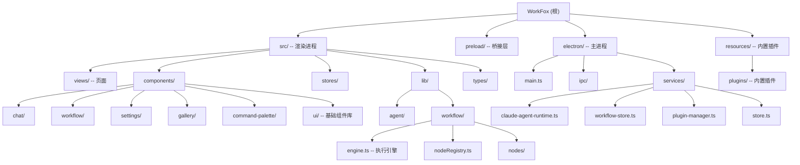

# WorkFox

> Workflow + AI Agent 桌面应用，基于 Electron + Vue 3 构建，提供可视化工作流编排与 AI Agent 驱动的自动化能力。

## 项目愿景

WorkFox 是一款桌面端工作流自动化工具，核心定位：

- **可视化工作流编辑器**：基于 Vue Flow 的拖拽式 DAG 编辑器，支持多种节点类型（流程控制、AI 执行、浏览器交互、展示等）
- **AI Agent 集成**：通过 Claude Agent SDK（@anthropic-ai/claude-agent-sdk）在主进程中运行 AI Agent，支持流式输出、工具调用、thinking blocks
- **插件系统**：支持第三方插件扩展，可注册自定义工作流节点、工具和视图
- **多标签页**：多工作流并行编辑，每个标签页独立维护工作流状态和 Chat 会话

## 架构总览

采用 Electron 标准三层架构（Main / Preload / Renderer）：

```
Renderer (Vue 3 + Vite)
  |-- src/                      渲染进程（前端）
  |   |-- views/                页面级组件（Home / Editor / Gallery）
  |   |-- components/           业务组件（chat / workflow / settings / gallery / command-palette / ui）
  |   |-- stores/               Pinia 状态管理（chat / workflow / ai-provider / tab / plugin / ...）
  |   |-- lib/                  核心逻辑库
  |   |   |-- agent/            Agent 流式通信、工具发现、工作流工具定义
  |   |   |-- workflow/         工作流引擎（拓扑排序、节点分发、变量解析、执行引擎）
  |   |-- router/               Vue Router（hash 模式）
  |   |-- types/                TypeScript 类型定义
  |   |-- styles/               Tailwind CSS 全局样式（含 light/dark 主题变量）
  |
Preload
  |-- preload/index.ts          contextBridge API 定义（IPC 通道映射）
  |
Main (Electron)
  |-- electron/
      |-- main.ts               应用入口，创建窗口、注册 IPC handlers、启动插件
      |-- ipc/                  IPC handlers（chat / workflow / plugin / shortcut / tabs / agent-settings）
      |-- services/             核心业务服务
          |-- claude-agent-runtime.ts   Claude Agent SDK 运行时（流式桥接、工具适配）
          |-- workflow-store.ts         工作流持久化（每工作流独立 JSON 文件）
          |-- plugin-manager.ts         插件生命周期管理
          |-- store.ts                  electron-store 全局配置（AI providers / shortcuts / tabs）
          |-- chat-history-store.ts     Chat 历史（IndexedDB 跨进程代理或文件存储）
          |-- workflow-tool-dispatcher.ts 工作流工具调度（主进程 <-> 渲染进程协作）
          |-- ...
  |
Backend (Node.js 子进程)
  |-- backend/
      |-- main.ts               backend 入口，启动 HTTP + WS 服务
      |-- app/                  config / logger / server factory
      |-- ws/                   channel router / connection manager / handlers
      |-- workflow/             execution / interaction / recovery
      |-- storage/              workflow / version / execution-log / operation-history
      |-- plugins/              backend plugin registry / builtin fs/fetch api
  |
Shared
  |-- shared/                  前后端共享协议、执行事件、插件入口与能力定义
```

## 模块结构图



## 模块索引

| 模块路径 | 职责 | 语言 | 入口文件 |
|---|---|---|---|
| `src/` | 渲染进程（Vue 3 SPA） | TypeScript / Vue | `src/main.ts` |
| `src/lib/agent/` | AI Agent 流式通信、工具发现、工作流工具 | TypeScript | `agent.ts` |
| `src/lib/workflow/` | 工作流编辑与本地 fallback 执行逻辑 | TypeScript | `engine.ts` |
| `src/components/chat/` | Chat 对话面板组件集 | Vue / TS | - |
| `src/components/workflow/` | 工作流编辑器组件集（画布、节点、属性面板） | Vue / TS | - |
| `src/components/settings/` | 设置对话框组件 | Vue / TS | - |
| `src/stores/` | Pinia 状态管理 | TypeScript | - |
| `src/types/` | 全局类型定义 | TypeScript | `index.ts` |
| `preload/` | Electron Preload（contextBridge） | TypeScript | `index.ts` |
| `electron/` | Electron 主进程 | TypeScript | `main.ts` |
| `backend/` | Node.js backend 服务 | TypeScript | `backend/main.ts` |
| `shared/` | shared WS 协议 / 执行事件 / 插件入口能力 | TypeScript | `shared/index.ts` |
| `electron/ipc/` | IPC Handler 注册 | TypeScript | - |
| `electron/services/` | 主进程业务服务 | TypeScript | - |
| `resources/plugins/` | 内置插件（window-manager / file-system / fetch / jimeng） | JavaScript | 各 `main.js` |

## 运行与开发

```bash
# 安装依赖（pnpm）
pnpm install

# 开发模式（electron-vite dev，含 HMR）
pnpm dev

# 构建产物
pnpm build

# 单独编译 backend
pnpm build:backend

# backend smoke 回归
pnpm smoke:backend

# 打包安装程序（electron-builder）
pnpm pack
```

### 环境要求

- Node.js >= 18
- pnpm >= 10
- Electron 35.x（devDependency 自动安装）

### 构建工具链

- **electron-vite** 3.x：主进程 / 预加载 / 渲染进程三合一 Vite 构建
- **electron-builder** 26.x：多平台打包（macOS DMG, Windows NSIS）
- **Tailwind CSS** 4.x（通过 @tailwindcss/vite 插件集成）
- **TypeScript** 5.7.x

### 路径别名

- `@/*` -> `./src/*`（在 `tsconfig.web.json` 和 `electron.vite.config.ts` 中配置）
- `@shared/*` -> `./shared/*`（renderer / backend / node 共享协议）

## Backend Migration Status

- workflow CRUD、folder、version、execution log、operation history 已可通过 backend WS 通道工作
- workflow execution 已默认按 backend-first 设计组织，前端 store 通过 execution events 和 recovery 驱动执行态
- `agent_run`、`window-manager`、`delay` 这类本地能力通过 interaction bridge 回到 Electron 执行
- renderer 仍保留少量 local fallback，用于兼容未完全迁移场景，不应再作为默认主路径扩展

### Feature Flag

- 持久开关：`localStorage['workfox.useWorkflowBackend'] = '1'`
- 构建期开关：`VITE_USE_WORKFLOW_BACKEND=1`

### Verification Gate

迁移相关的最小回归命令：

```bash
pnpm exec tsc -p tsconfig.web.json --noEmit
pnpm build:backend
pnpm smoke:backend
pnpm build
```

更细的验证说明见：

- `docs/superpowers/plans/2026-04-22-workfox-backend-migration-verification.md`

## 测试策略

当前项目尚未包含自动化测试框架。建议未来引入：

- 单元测试：Vitest（与 Vite 生态一致）
- 组件测试：@vue/test-utils
- E2E 测试：Playwright（Electron 支持）

## 编码规范

- **语言**：TypeScript strict mode（所有 tsconfig 均启用 `strict: true`）
- **前端框架**：Vue 3 Composition API（`<script setup lang="ts">`）
- **状态管理**：Pinia（factory 模式创建 scope 化 store，如 `createChatStore(scope)`）
- **样式**：Tailwind CSS 4 + CSS 自定义属性主题系统（light/dark）
- **IPC 通信**：通过 `preload/index.ts` 的 `contextBridge.exposeInMainWorld('api', ...)` 统一暴露
- **数据持久化**：
  - 渲染进程：Dexie（IndexedDB）用于 Chat 会话/消息
  - 主进程：electron-store（JSON 文件）用于全局配置；独立 JSON 文件用于工作流
- **组件库**：shadcn-vue 风格的基础 UI 组件（`src/components/ui/`）

## AI 使用指引

### 核心数据流

1. 用户在 Chat 面板输入消息 -> `stores/chat.ts` -> `lib/agent/agent.ts`（构造请求）
2. 通过 IPC `chat:completions` 发送到主进程
3. 主进程 `claude-agent-runtime.ts` 使用 Claude Agent SDK 创建流式会话
4. 流式事件通过 IPC `chat:stream:*` 频道回传渲染进程
5. 渲染进程 `lib/agent/stream.ts` 解析事件，更新 Pinia store，驱动 UI 更新

### 工作流执行

1. backend execution manager 负责工作流执行、pause/resume/stop、execution recovery、execution log 持久化
2. renderer workflow store 订阅 `workflow:*` / `node:*` / `execution:*` 事件更新 UI
3. `agent_run` 与本地 bridge 节点通过 WS interaction 回到 Electron 执行
4. Node.js 内可闭环的插件节点直接在 backend plugin registry 中执行

### 插件系统

- 插件目录：`resources/plugins/`（开发模式）或 `process.resourcesPath/plugins/`（打包后）
- 每个插件包含 `info.json`（元信息）+ `main.js`（入口）+ 可选 `workflow.js` / `tools.js` / `api.js`
- 插件可提供：自定义工作流节点、AI Agent 工具、独立视图
- 事件总线：`plugin-event-bus.ts`（EventEmitter2）

### 修改代码时的注意事项

- 修改 IPC 接口时，需同时更新 `preload/index.ts` 的 API 定义和对应的 `electron/ipc/*.ts` handler
- 新增 shared 协议或执行事件时，优先改 `shared/`，再让 renderer / backend / Electron 消费 shared source-of-truth
- Chat store 使用工厂模式 `createChatStore(scope)` 支持多 scope（agent / workflow）
- 新增工作流节点时，先判断它属于：
  - backend 可直接执行的 server/plugin 节点
  - 需要 interaction bridge 的 Electron-local 节点
  - renderer-only 编辑态节点

## 变更记录 (Changelog)

| 日期 | 操作 | 说明 |
|---|---|---|
| 2026-04-20 | 初始化 | 首次生成项目架构文档，完成全仓扫描 |
